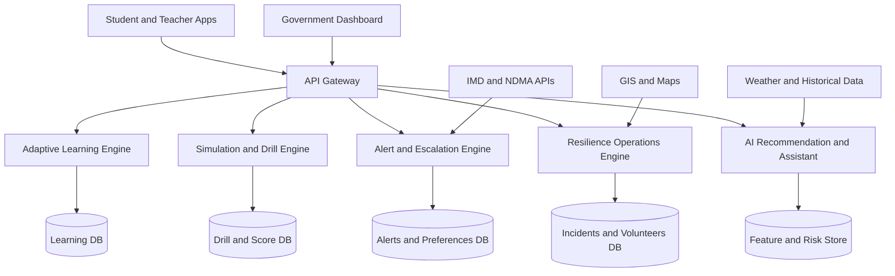

# SurakshaAI: SIH25008 Solution Blueprint

Government of Punjab: Disaster Preparedness and Response Education System

## 1. Vision

SurakshaAI is a statewide disaster preparedness and response ecosystem for educational institutions. The platform combines adaptive learning, simulation-based practice, geo-risk intelligence, alerting, and institutional command analytics to improve readiness and reduce response time.

Primary outcomes:

- Build students as trained first responders.
- Enable schools to run measurable preparedness programs.
- Give district and state authorities a live preparedness index.

## 2. Problem Alignment

The system addresses SIH25008 by solving three operational gaps:

- Training gap: awareness exists, skill retention is low.
- Coordination gap: schools, teachers, and authorities act in silos.
- Intelligence gap: decision-makers lack real-time, local preparedness insights.

## 3. Professional Architecture

### 3.1 Multi-layer architecture

- Presentation layer:
  - Student application (web and mobile-ready)
  - Teacher and school command dashboard
  - District and state governance panel
- Application layer:
  - Adaptive Learning Engine
  - Simulation Engine
  - Alert and Escalation Engine
  - AI Recommendation Engine
- Data layer:
  - User and institution profiles
  - Learning and drill telemetry
  - Incident and volunteer operations
  - Geo-spatial risk datasets
- Integration layer:
  - IMD, NDMA, NASA feeds
  - GIS services (Mapbox/PostGIS)
  - Emergency service channels

### 3.2 Logical architecture (Mermaid)

## 4. Core Modules

### 4.1 Adaptive Learning Engine

- Personalized microlearning paths (2-5 min units).
- Dynamic difficulty based on quiz and interaction patterns.
- Skill certification tracks by disaster type.

Innovation:

- Behavior-aware sequencing to adapt content automatically.

### 4.2 Immersive Simulation Engine

- Scenario-driven drills: flood, fire, earthquake.
- Decision checkpoints with real-time scoring.
- Post-drill replay and feedback loop.

Advanced extension:

- AR evacuation overlays for campus navigation.
- VR drill packs for higher education institutions.

### 4.3 Intelligent Alert and Response System

- Real-time regional alerts from integrated feeds.
- Geofenced notifications by school and locality.
- Escalation graph: student -> teacher -> authority.

Advanced extension:

- AI-assisted severity prediction for incoming incidents.

### 4.4 Geo-Spatial Risk Intelligence

- Punjab risk layers: flood-prone, seismic, heat-risk.
- Historical heatmaps and vulnerability overlays.
- School-level exposure and risk trend tracking.

### 4.5 Smart Emergency Response

- One-tap SOS with auto-location share.
- Nearby shelters and hospitals discovery.
- Safer-route recommendation under hazard conditions.
- Low network fallback via lightweight SMS workflows.

### 4.6 AI Disaster Assistant

- Text and voice guidance for emergency actions.
- Region-aware instruction templates.
- Offline basic guidance model for low-connectivity zones.

### 4.7 Institutional Command Dashboard

- School readiness scorecards.
- Drill completion and quality analytics.
- District preparedness map and response readiness index.

### 4.8 Offline-First Architecture

- Progressive Web App behavior.
- IndexedDB caching for drills, checklists, and emergency packs.
- Background sync for delayed uploads.

## 5. SIH-Winning Differentiators

### 5.1 AI Risk Prediction Model

- Inputs: weather, topography, historical incidents.
- Outputs: flood likelihood, heatwave and severe weather risk.

### 5.2 School Digital Twin

- Virtual campus model with evacuation simulation.
- Route congestion and bottleneck analysis.

### 5.3 IoT Trigger Integration (Optional)

- Smoke and water-level sensor hooks.
- Auto-alert generation with confidence score.

### 5.4 Preparedness Score Index (PSI)

Composite score model per institution:

- Training Completion Rate (TCR)
- Drill Effectiveness Score (DES)
- Incident Response Score (IRS)
- Risk Exposure Weight (REW)

Suggested formula:

$$
PSI = 0.35\cdot TCR + 0.30\cdot DES + 0.20\cdot IRS + 0.15\cdot (100 - REW)
$$

### 5.5 Gamification at Scale

- State and district leaderboards.
- Competitions between institutions.
- Milestone rewards tied to preparedness outcomes.

## 6. Tech Stack (Industry-Grade)

- Frontend: React.js (web), Flutter (mobile extension)
- Backend: Node.js/Express or FastAPI for ML-heavy workloads
- AI/ML: Python, scikit-learn, TensorFlow
- Databases:
  - PostgreSQL + PostGIS for geo intelligence
  - MongoDB for operational data
  - Firebase/Redis channels for near real-time sync
- Cloud: AWS, Azure, or GCP with CI/CD and observability
- APIs: IMD, NDMA, weather feeds, GIS providers

## 7. Security and Compliance

- Role-based access control and policy enforcement.
- Data encryption in transit and at rest.
- Audit logs for sensitive operations.
- Consent and retention policy for student data.
- Government integration via secure service accounts.

## 8. Delivery Plan

### Phase 1 (MVP, 4-6 weeks)

- Adaptive modules, drills, alerts, incident reporting, dashboard basics.
- Offline emergency pack and checklist.

### Phase 2 (Pilot, 6-8 weeks)

- Geo-risk maps, PSI scoring, district analytics, chatbot improvements.

### Phase 3 (Scale, 8-12 weeks)

- AI prediction, digital twin pilot, IoT integration, statewide rollout controls.

## 9. Impact Metrics for Judges

- Response time reduction in drill-to-action workflows.
- Preparedness score growth across institutions.
- Alert acknowledgment speed.
- Drill participation and completion quality.
- Reduction in false escalation and delayed reporting.

## 10. Mapping to Current Repository

This repository already includes a strong foundation:

- Adaptive and role-based learning/drill workflows in frontend and backend modules.
- Alert ingestion and operations endpoints under backend routes.
- Risk and resilience workflows (incident, volunteer, forecast, offline pack).
- AI assistant and risk-prediction stubs in the ML directory.

Next engineering priorities for SIH final:

- Introduce PSI scoring service and district dashboard tiles.
- Add geofenced alert policy engine.
- Harden offline sync with conflict handling and retries.
- Add benchmark datasets for objective impact reporting.

## 11. Final SIH Deliverables Checklist

- Full-stack working prototype.
- Architecture and data-flow diagrams.
- AI model demo and explainability notes.
- Impact metrics dashboard with baseline vs pilot values.
- Pitch deck, technical report, and deployment plan.

This blueprint is prepared to be directly used in SIH presentations, documentation, and implementation planning.